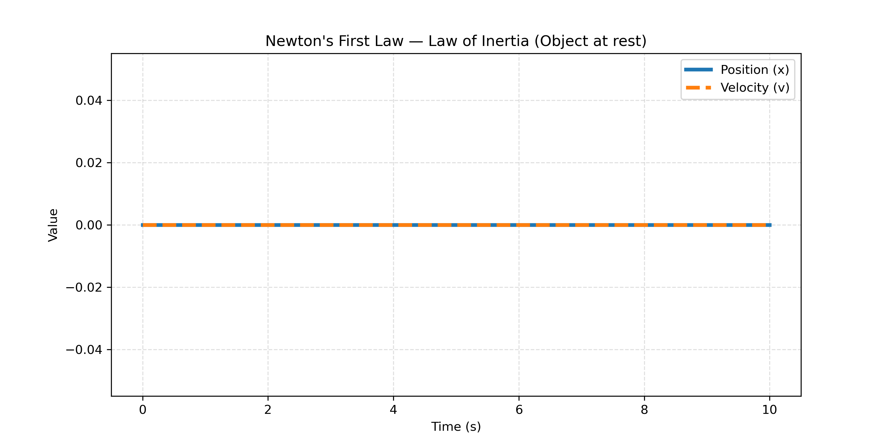
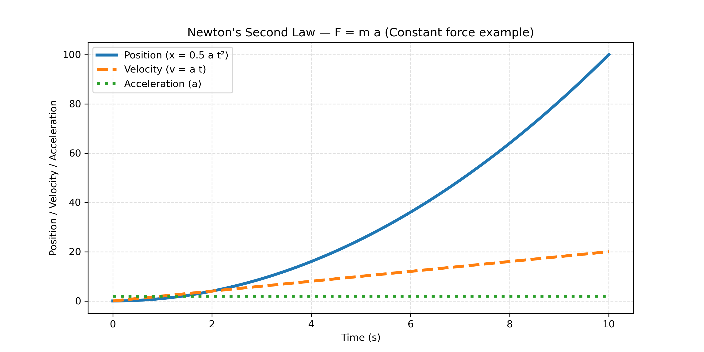
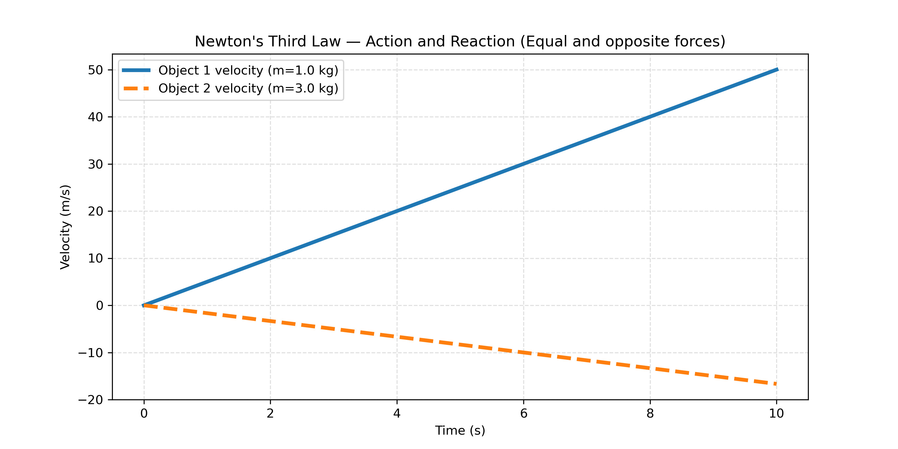

# Newton’s Laws of Motion: Theory, Simulation, and Visualization

## Overview

This project presents a computational and theoretical study of Newton’s Three Laws of Motion, which form the foundation of classical mechanics. The goal is to translate fundamental physical principles into clear numerical simulations and graphical representations.

By combining analytical concepts with Python-based visualizations, the project demonstrates how force, mass, and motion are quantitatively related.

## Objectives

* To understand Newton’s Three Laws of Motion at a conceptual and mathematical level
* To simulate physical systems using Python
* To visualize motion, force, and acceleration
* To connect theoretical equations with computational results

## Theoretical Background

### Newton’s First Law (Law of Inertia)

An object remains at rest or moves with constant velocity unless acted upon by a net external force.

* If F_net = 0 → velocity is constant
* Acceleration = 0

This law introduces the concept of inertia, which describes resistance to changes in motion.

### Newton’s Second Law

The relationship between force, mass, and acceleration is given by:

F = m·a

* Force and acceleration are directly proportional
* Mass and acceleration are inversely related

This law provides the fundamental equation used to model motion.

### Newton’s Third Law

For every action, there is an equal and opposite reaction.

* Forces always occur in pairs
* These forces act on different objects

Examples include walking, rocket propulsion, and object interactions.

## Computational Approach

This project uses Python to simulate physical systems governed by Newton’s laws.

### Tools

* NumPy — numerical computation
* Matplotlib — visualization

The simulations model how objects respond to forces over time.

## Visualizations and Results

### 1. First Law (Inertia)



This visualization shows motion with zero net force.
The object maintains constant velocity, demonstrating the principle of inertia.

### 2. Second Law (F = m·a)



This graph demonstrates how a constant net force produces constant acceleration.
Changes in mass or force directly affect the rate of acceleration.

### 3. Third Law (Action–Reaction)



This visualization illustrates equal and opposite forces acting on interacting objects.
Although the forces are equal, their effects differ depending on mass.

## Key Insights

* Motion changes only when a net force is applied
* Acceleration depends on both force and mass
* Forces always occur in pairs
* Physical laws can be understood more clearly through simulation

## Applications

* Classical mechanics and motion analysis
* Engineering systems
* Space and rocket dynamics
* Everyday physical interactions
  
## Articles

This project is supported by detailed written explanations available in both English and Turkish.

- English version: `articles/Newtons Three Law of Motion.eng.pdf`  
- Turkish version: `articles/Newtons Three Law of Motion.tr.pdf`  

These articles provide deeper theoretical explanations and complement the simulations.

## Project Structure

```
Newtons_Law_of_Motion/
│── README.md
│── scripts/
│── results/
│── articles/
```

## Future Improvements

* Adding multi-body simulations
* Including variable forces and friction
* Extending simulations with differential equations
* Creating animated visualizations

## Author

Azra Aleyna Bozkurt
Physics Applicant — Computational Physics Focus

## Conclusion

This project demonstrates how Newton’s Laws of Motion can be explored not only through theory but also through computational modeling. By combining equations with simulations, it provides a deeper and more practical understanding of fundamental physics principles.
